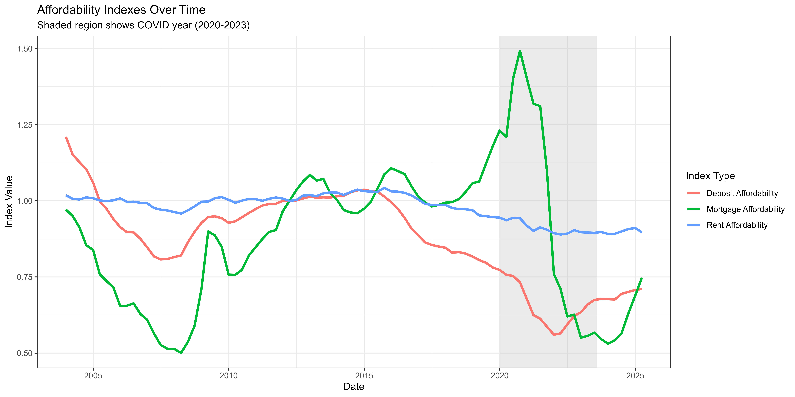
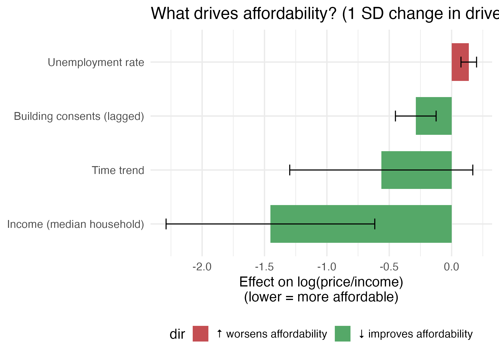
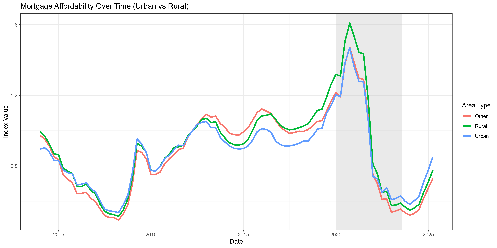
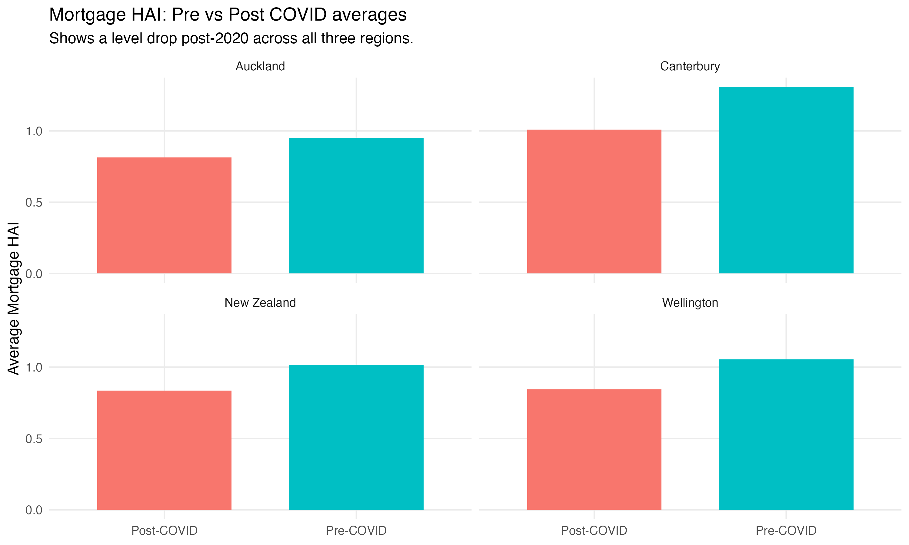

# Housing Affordability in New Zealand

An analysis of the key economic, housing and demographic factors associated with housing affordability across New Zealand.

This group capstone project integrates multiple datasets to examine how factors including household income, rent, interest rates, housing supply and regional differences relate to housing affordability over time.

**R · tidyverse · Statistical Modelling · Data Integration · Data Visualisation · GitHub**

## Project Overview

Housing affordability is influenced by a combination of housing market conditions, household finances and broader economic factors. This project investigates the key factors associated with housing affordability in New Zealand and how affordability differs across regions and between urban and rural areas.

The analysis also considers changes around the COVID-19 period to explore how affordability and housing market conditions shifted during this time.

### Key Questions

The project investigates:

1. Which factors are most strongly associated with housing affordability in New Zealand?
2. How does housing affordability vary across regions?
3. How does affordability differ between urban and rural areas?
4. How did housing affordability change around the COVID-19 period?

## Data

The project combines multiple datasets covering housing, economic and demographic characteristics.

Each source dataset was cleaned and analysed separately using dataset-specific R scripts before relevant variables were integrated into a master analytical dataset.

Examples of variables examined include:

- House prices
- Household income
- Rent
- Interest rates and the Official Cash Rate (OCR)
- Housing supply
- Unemployment
- Regional and urban/rural characteristics

The cleaned and integrated dataset used for the final analysis is available in the `data/processed/` directory.

## Data Processing & Analysis

The project uses a multi-stage workflow in which each source dataset has its own cleaning and exploratory analysis process.

```text
Raw source datasets
        │
        ├── Housing data ───────→ Cleaning + analysis
        ├── Income data ────────→ Cleaning + analysis
        ├── Rental data ────────→ Cleaning + analysis
        ├── Interest rate data ─→ Cleaning + analysis
        ├── Housing supply ─────→ Cleaning + analysis
        ├── Unemployment data ──→ Cleaning + analysis
        └── Other datasets ─────→ Cleaning + analysis
                                      │
                                      ↓
                              Data integration
                                      │
                                      ↓
                           Clean master dataset
                                      │
                                      ↓
                       Final analysis & modelling
```

The analysis involved:

- Cleaning and transforming multiple datasets from different sources
- Standardising variables, dates and geographic classifications
- Exploring trends in housing affordability and potential explanatory factors
- Integrating the processed datasets into a master analytical dataset
- Comparing affordability across regions and urban/rural areas
- Applying statistical modelling to examine relationships between housing affordability and potential drivers
- Investigating changes around the COVID-19 period

## Key Findings

- **Household income, rent, interest rates and housing supply** were identified as key factors associated with housing affordability.

- Housing market conditions varied geographically, with **Auckland exhibiting higher housing prices than Christchurch and Wellington**.

- **Urban housing prices were generally higher than rural housing prices**, demonstrating geographic differences in housing market conditions.

- The COVID-19 period was associated with an **affordability squeeze**, with changes in housing prices and economic conditions contributing to increased affordability pressures.

## Visualisations

The project used exploratory and analytical visualisations to investigate affordability trends, potential drivers and geographic differences.

<!-- Replace filenames below with the exact filenames used in your images folder -->

### Housing Affordability Over Time



### Key Drivers of Housing Affordability



### Urban vs Rural Affordability



### COVID-19 and Housing Affordability




## Documentation

For a detailed description of the data, methodology, statistical analysis, results and conclusions, see the [Final Project Report](docs/final-report.pdf).

## Project Context

This project was completed as a **group capstone project for DATA309 at the University of Canterbury**.

The project involved collaborative data collection, cleaning, integration, statistical analysis, interpretation and communication of findings.
